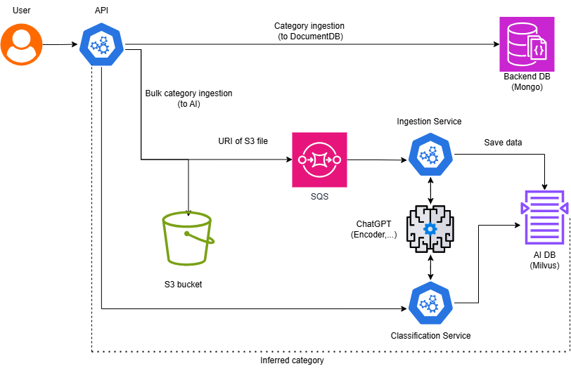

<h1>Category Classification of Producs</h1>

> This document release with purpose to show how I using AI in Category Classification of Products.

## What is the Category of a Product?  
The **category of a product** represents its classification or grouping based on shared characteristics, purpose, or use. For instance, a pair of sneakers may belong to the "Footwear" category, while a smartphone might fall under "Electronics." Categories help to organize products systematically, making it easier to locate, describe, and understand their function or market.  

Categories can vary in granularity, ranging from broad classifications (e.g., "Clothing") to highly specific ones (e.g., "Men's Running Shoes"). This structured approach ensures that products are logically grouped, improving usability for businesses and consumers alike.

## Why Do We Need Category Classification?  
Product category classification is crucial for several reasons:

1. **Improved Customer Experience**  
   - Helps users quickly find the products they are looking for in online stores.
   - Enables better search functionality and intuitive navigation in e-commerce platforms.

2. **Enhanced Product Discovery**  
   - Ensures products are correctly indexed for search engines and recommendation systems.
   - Facilitates personalized recommendations by linking related items within the same category.

3. **Efficient Inventory Management**  
   - Allows businesses to organize and manage large inventories more effectively.
   - Simplifies tracking and analyzing product trends within specific categories.

4. **Data-Driven Decision Making**  
   - Provides insights into product performance, trends, and customer preferences by category.
   - Supports marketing strategies, such as targeted promotions or dynamic pricing.

5. **Automation and Scalability**  
   - Enables the use of machine learning or AI-driven systems to classify products at scale, reducing manual effort.
   - Standardizes categorization across marketplaces and platforms, especially in multi-vendor environments.

6. **Compliance and Reporting**  
   - Meets industry standards for categorization, such as those required in taxonomies like Google Shopping or local regulations.
   - Streamlines reporting processes for sales and inventory analysis.

You can check thourgh the [Google category list](https://www.google.com/basepages/producttype/taxonomy-with-ids.en-US.txt)

## How it works?

Category classification relies on a vector database (Milvus). Textual product information is first processed through a generative LLM prompt (ChatGPT), then embedded, and the class with the closest embedding is returned as the classification result. This setup acts as zero-shot classifier where classed must be both known and embedded pre-inference. This emplementation uses a cloud-managed Kubernetes cluster solely to host the vector database, Milvus.

This approach is not completely data-driven but relies on embedding product information and assigning it to closest (semantic) category embedding. To add custom classes, an ingestion service is required to
    
- Calculate the class embedding upon request.
- Ingest the class and it embedding to Milvus.

Given that categories are rarely updated, we assume the traffic will be intermittent. That's the main reason why an *asynchronous design* is preferred.

In addition to ingestion service, a classification service is also required which

- Infers the product embedding upon request.
- Queries Milvus for closest vector

Both service will share the same embedder and the ingestion service are triggered by SQS events

## Milvus Multi-Tenancy Strategy and Data Organisation

This approach adopts the partition-key-based multi-tenancy strategy, capable of scaling to over 10,000,000 tenants.

For more details including other multi-tenancy strategies, that leveraging Milvus collections and partitions differently, refer to the [Milvus Multi-Tenancy Documentaion](https://milvus.io/docs/multi_tenancy.md)

- **Parition Limits**: In Milvus 2.2.x, the hard limit on the number of partitions is 4096. The recommendation is to keep this number under 10k. More recent versions also have similar limits.
- **Collection Limits**: The hard limit on collection is 65536, with performance degrading as the collection size grows.

## Timestamps for data integrity

Delegating the responsibility of preserving data integrity to the database by the following mechanism:

- Implement a timestamp field which reflects the timestamp of the backend ingestion request. (e.g. storing the same timestamp for each vector)
- Ensure that vector updates occur only if the existing vectors in Milvus have a timestamp older than the incomming request (using timestamp-based filtering is an option).

With this mechanism in place, race conditions are effectively avoided, enabling reliable deployment within a fully event-driven architecture.