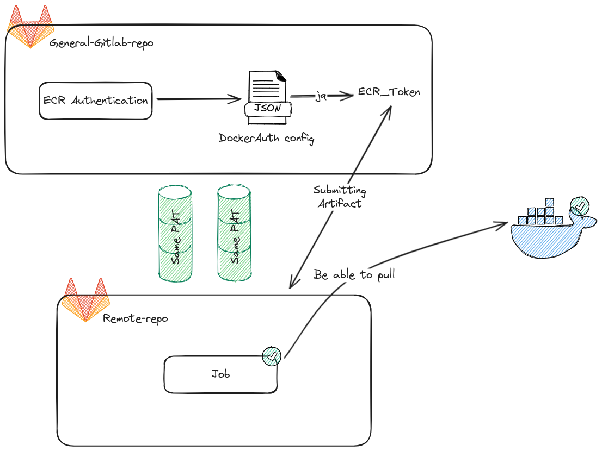

<h1>Gitlab CI template</h1>

> The biggest role will provide methodology for new repositories inheritance

# Purpose

1. Optimize the pipeline from new one
2. Minimize effort for developer when create new CI/CD for project
3. Centrally manage job pipelines in the form of templates for inheritance

# Docker Image

> Provide the vision about why we need to use private registry for container images

## Private Elastic Container Registry

For consistency with all repositories inside project, ECR needs to be implemented for

- Fast delivery image to your repository
- Reduce complex when operate image
- Intergrate multiple things inside image
- Mitigate securiry issues

Through this concept, we can optimize the performance of pipeline when build and deployment

## Gitlab Container Registry

The GitLab Container Registry is a secure and integrated Docker container registry that is part of the GitLab ecosystem. It allows users to build, publish, share, and deploy container images directly from their GitLab projects. This registry is tightly integrated with GitLab CI/CD pipelines, providing seamless automation for containerized application workflows.

GitLab Container Registry eliminates the need for a separate Docker registry service, allowing teams to focus on development while reducing complexity and ensuring a streamlined development-to-deployment experience.

## GitlabCI Template

In my project, I store the docker image in the AWS Elastic Container Registry and Gitlab Container Registry. So I will have 2 scripts to access and manage the 2 registries as above.

### [ecr-auth](./templates/ci/cr-auth.gitlab-ci.yml)

<div align="center">
    
    <p type="text-align: center;">Authenticate Private ECR and Gitlab CR</p>
</div>

Remote repositories can use following template by script

```yaml
stages:
  - auth
  - check

include:
  - project: "${repository_url}"
    file: "/templates/ci/ecr-auth.gitlab-ci.yml"
    ref: "main"

authentication:
  stage: auth
  extends: .ecr_remote_auth

validate:
  stage: check
  # The image comes from private container registry of ECR 
  image: "${image_url}"
  script:
    - echo "I am in private container !!!"
```